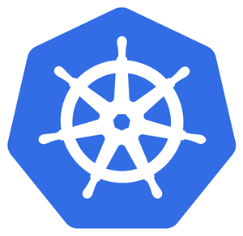

# **Kubernetes Basics**

Markdown Presentation With [Marp](https://marp.app/)

---

# Table of contents 🤯

##### This presentation is intended to explore the Kubernetes Basics.

<br/>
**We're gonna use the GKE (Google Kubernetes Engine) on t he GCP (Google Cloud Platform)

```markdown
- kubectl  
- GKE registration
- Deploy a pod
- ConfigMap & Secret
- Volumes
- Service & Ingress
- Tiny working application
- CLI Tools (k9s, kubectx/kubens, stern)
```

---
# But first... What actually is Kubernetes?

<br/>

They define it as

> ### Production-Grade Container Orchestration 🧐

---

# kubectl

As [documentation](https://kubernetes.io/docs/reference/kubectl/kubectl/) states:

> `The Kubernetes command-line tool, kubectl, allows you to run commands against Kubernetes clusters`

<br/>

If you are using `oh-my-zsh` you can enable the `kubectl` plugin which provides commands autocompletion. To make command easier, I suggest to create an alias to map `kubectl` to `k`.

---

# GKE Registration

Google provides the Google Cloud SDK which allows to register your project-based cluster on your machine. Here is the [quickstart](https://cloud.google.com/sdk/docs/quickstart-linux)

```shell
$ gcloud container clusters get-credentials  <cluster-name> --zone <zone> --project <project-id>
```

It will create the `kubeconfig` entry in your machine; now run:

```shell
$ k config get-contexts

CURRENT   NAME                  CLUSTER               AUTHINFO                                          NAMESPACE
*         gke_abiding-orb-XXX   gke_abiding-orb-XXX   gke_abiding-orb-XXX

# if you have more than one context use the following 
$ k config use-context gke_abiding-orb-XXX
```

---

# 🐳🐳 Pod 🐳🐳

A [Pod](https://kubernetes.io/docs/concepts/workloads/pods/pod-overview/) is the unit of work in Kubernetes and represents processes running in your cluster.

`It internally runs one or more containers` 

Pod containers are always co-located and co-scheduled, and run in a shared context

Kubernetes will then control the lifecycle of the pods, on which node they will be installed and so on

---
# Deployment

A [Deployment](https://kubernetes.io/docs/concepts/workloads/controllers/deployment/) describes a multiple set of identical Pod, how they are deployed and replicated in the cluster.

<br/>

Let's say we want deploy an instance of `nginx`

---

###### `nginx-deployment.yaml`

```yaml
apiVersion: apps/v1
kind: Deployment
metadata:
  name: nginx-deployment
  labels:
    proxy-dep: proxy-dep-nginx
spec:
  replicas: 1  # number of the Pods to be created
  selector: # how the Deployment finds which Pods to manage 
    matchLabels:
      proxy: proxy-nginx
  template:
    metadata:
      labels:
        proxy: proxy-nginx
    spec:
      containers:  # list of containers inside the pod
        - name: proxy-nginx
          image: nginx:1.7.9
          ports:
            - containerPort: 80
```

---

With the command `apply` you create the deployment

```shell
$ k apply -f nginx-deployment.yml
```

with `get` you see the list of both deployments and pods:

```shell
$ k get deployments

$ k get pods --show-labels
```

---

`rollout` shows you the status of the deployment and also allows to restart all the pods described by the deployment:

```shell
$ k rollout status deployment nginx-deployment

$ k rollout restart deployment nginx-deployment
```

**rollout also allows to view the history of the deployment and optionally rollback to specific version

---

In order to manually scale the pod you can use the `scale` command

```shell
$ k scale deployment nginx-deployment --replicas=4 
```

**you can also setup an `autoscaler` to allow kubernets to do it automatically if needed

---

## Resources Limits & Requests

Very often, will be required to adjust resources (CPU and Memory) to a deployment. To do so, you will add the following snippet to the deployment under the `.spec.containers[X]`:

```yaml
resources:
  limits:
    cpu: 100m
    memory: 1Gi
  requests:
    cpu: 50m
    memory: 500Mi
``` 

---

# ConfigMap

ConfigMap allows to separate configurations from the container image.

For instance let's say we have `foo.properties` and `baz.properties`. We can run the creation command  using `--from-file` and see the result:

```shell
$ k create configmap foobar --from-file=topics/config-secrets/example
configmap/foobar created
```

---

```shell
$ k describe configmap foobar
  Name:         foobar
  Namespace:    default
  Labels:       <none>
  Annotations:  <none>
  
  Data
  ====
  baz.properties:
  ----
  BAZ=waldo
  foo.properties:
  ----
  FOO=bar
  Events:  <none>
```

Or, using a single file and the flag `--from-env-file`

---

## Using it as volume

```yaml
apiVersion: v1
kind: Pod
metadata:
  name: pod
spec:
  containers:
    - name: test-pod
      image: test-pod
      volumeMounts:
      - name: foobarvol
        mountPath: /config
  volumes:
    - name: foobarvol
      configMap:
        name: foobar
```

---

You can also set the property `items` in order to get only the file you actually need

```yaml
  ...
      volumeMounts:
      - name: foobarvol
        mountPath: /config
  volumes:
    - name: foobarvol
      configMap:
        name: foobar
        items:
        - key: foo.properties
          path: foonew.properties
```

---

# Secrets